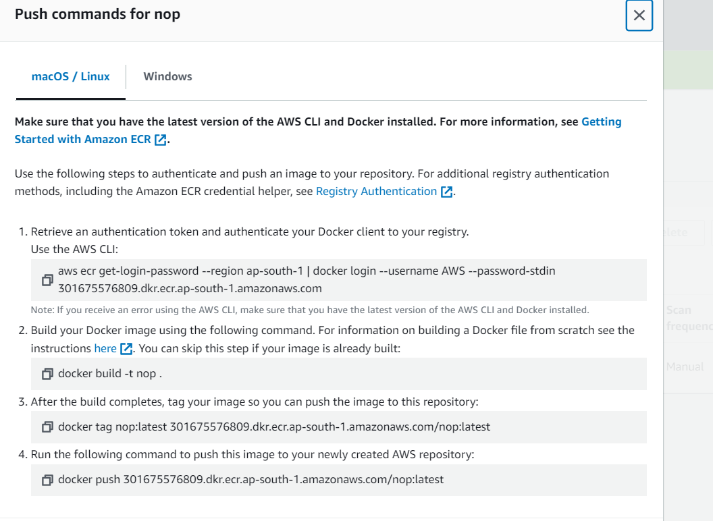
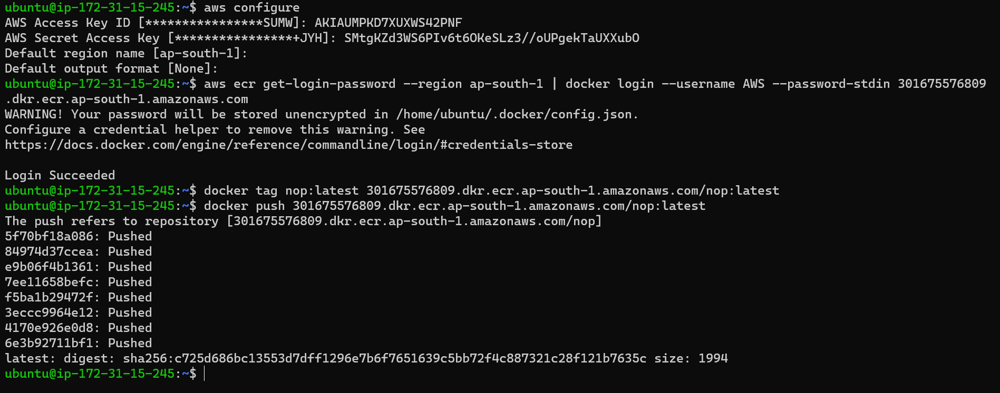
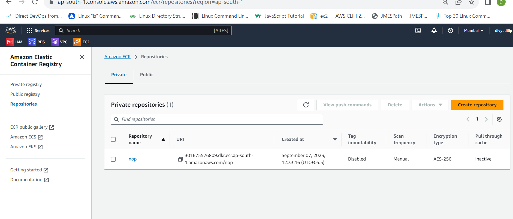
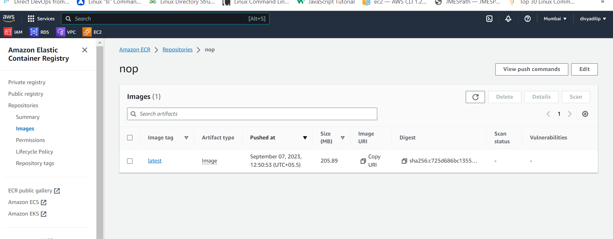

#### pushing an docker image to aws elastic container registry
* Create an ECR repo with nop(private) in aws.
* create an instance with docker installed and also install aws cli and configure with credentials.
* build the docker image.
* Run the commands by using view push commands in ECR
* 
* Execute the commands 
* 
* A repo with name `nop` is created.
* 
* Now the image is has been pushed to ecr 
* 

